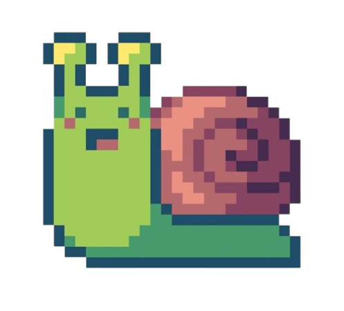

  

  

    
🧠 <strong>Studying</strong> Computer Science at <strong>FIAP</strong>

    
🛠️ <strong>Graduated</strong> in Systems Development at <strong>SENAI</strong>

    
🤖 Interested in <strong>Artificial Intelligence, Machine Learning, Data Science and Automation</strong>

    
💡 Known for my <strong>creativity and problem-solving skills</strong>

    
📚 Passionate about <strong>continuous learning and exploring new technologies</strong>

  

  

## 🛠️ Technology Stack

**Main Skills:**

  
&nbsp;
&nbsp;
&nbsp;
&nbsp;
&nbsp;
&nbsp;
&nbsp;
&nbsp;
&nbsp;
&nbsp;
&nbsp;
&nbsp;
&nbsp;

**Learning:**

**Tools:**

  
   
  

---

